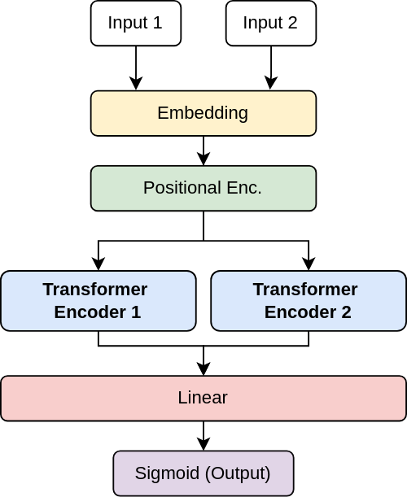

# CodeReps-Transformer
Transformer models learn to associate code representations. 

This project/experiment aims to see how well can small deep learning transformer models \
learn and perform at associating Python functions to their respective code representations,\
namely their AST (*Abtract Syntax Tree*) & CFG (*Control Flow Graph*).

First, I built a dataset of triplets (function, AST, CFG).\
*The code used to do it can be found in the [dataprep](./dataprep/) folder.*

Then, we shuffle some percentage of the dataset, that is, depending on the task,\
we exchange say 50% of ASTs (or CFGs) between each other. The model will then be\
trained to find, either using or the source code, or the CFG, or both, if they are\
related to the AST or not, that is if this AST was generated from the function or not.

For now, I performed two experiments:
1. Training a model to associate a function to its CFG: [src_to_ast](./src_to_ast/).
2. Training a model to associate a function to its AST: [src_to_cfg](./src_to_cfg/).

Each folder contains the same files (as notebooks):
- `training.ipynb` where we define and train the model.
- `eval.ipynb` where we assess the performance of the model.

These models are built on the same base:

However, different hyperparameters of the encoders are not the same for each model,\
as well as the tokenizers (see the code directly for details).

I do not claim that this is the best architecture for this task, but it has the benefits of\
being simple and straightforward.