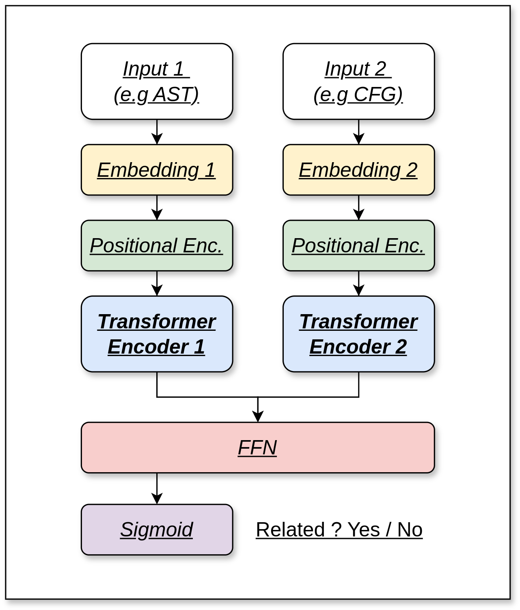

# codereps
Transformer models learn to associate code representations. 

This project/experiment aims to see how well can small deep learning transformer models learn and perform at associating Python functions to their respective code representations, namely their AST (*Abtract Syntax Tree*) & CFG (*Control Flow Graph*).

First, I built a dataset of triplets (Function, AST, CFG).\
*The code can be found in [dataprep](./dataprep/).*

The second step was to train some tokenizers on our representations.\
*The code can be found in [tokenizers](./tokenizers/).*

Then, we shuffle some percentage of the dataset, that is, depending on the task, we exchange say 50% of ASTs (or CFGs) between each other. The model will then be trained to find, either using or the source code, or the CFG, or both, if they are related to the AST or not, that is: *was this AST generated from the function or not*.

For now, I performed three experiments:
1. Training a model to associate a function source code to its AST: [src_to_ast](./src_to_ast/).
2. Training a model to associate a function source code to its CFG: [src_to_cfg](./src_to_cfg/).
3. Training a model to associate a function CFG to its AST: [cfg_to_ast](./cfg_to_ast/).

These directories all contain the same two files (*notebooks*):
- `training.ipynb` where we define and train the model.
- `eval.ipynb` where we assess the performance of the model.

Models are built on the same base:

This is an example with two inputs because this is the configuration we mostly used.

Each input goes in its associated encoder, allowing us to get a fixed size representation of it, then, encoder outputs are concatenated and fed to a feedforward neural network. 

Different hyperparameters of the encoders are not the same for each model,as well as the tokenizers (see the code directly for details).

*I do not claim that this is the best architecture for this task, but it has the benefits of being simple and straightforward.*
